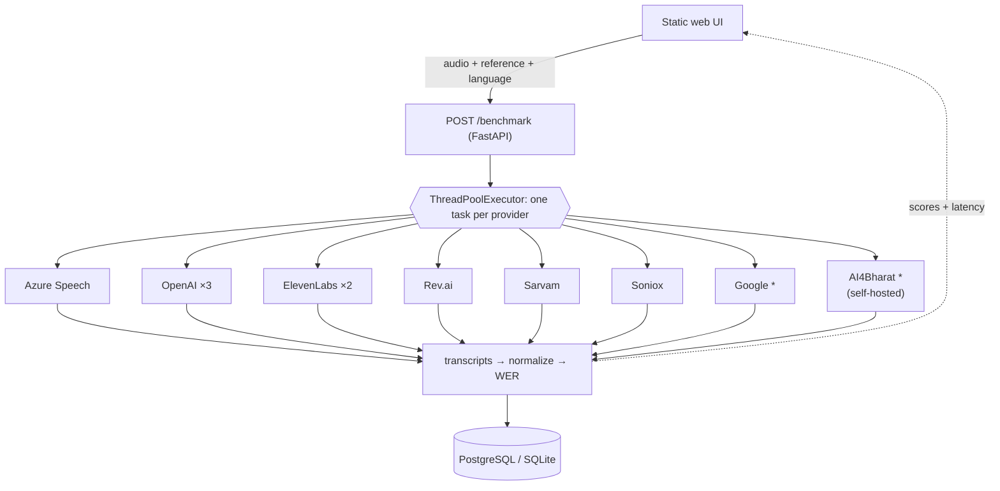

# STT Benchmark — Backend

[](https://github.com/SASHI117/stt-benchmark-backend/actions/workflows/ci.yml)


A FastAPI service that sends one audio clip to eight speech-to-text providers
(eleven models) and scores each transcript against a reference with **word
error rate** and **latency**. I built it during my internship at FarmVaidya.ai
to compare ASR engines on Indian-language farmer audio. The question it
answers is *which provider is accurate enough, fast enough, on our audio*,
not on a vendor's English benchmark.

The web UI lives in [stt-benchmark-frontend](https://github.com/SASHI117/stt-benchmark-frontend).
The self-hosted AI4Bharat model it calls is [ai4bharat_stt](https://github.com/SASHI117/ai4bharat_stt).

## Architecture



`*` needs an explicit `language_code`. The others detect the language themselves.

| Module | Responsibility |
|---|---|
| `main.py` | Request validation, the provider table, concurrent fan-out, persistence |
| `*_stt.py` | One adapter per provider. Each returns `{provider, model, text, latency_ms}` (or a list for multi-model providers) |
| `polling.py` | `poll_until()`: deadline-bounded polling for async job APIs (Rev.ai, Soniox) |
| `metrics/` | Unicode-aware text normalization and Levenshtein WER |
| `database.py`, `models.py` | SQLAlchemy engine, `benchmark_runs` / `benchmark_results` tables |

## How a request is scored

1. The upload is written to a temp file **with its original extension**, since
   several SDKs pick the decoder from it.
2. Every provider runs concurrently. Each adapter times only its own call, so
   the reported latency is per provider. The total request time is the
   slowest provider, not the sum of all of them.
3. Each transcript and the reference are normalized: NFC → casefold →
   remove Unicode punctuation/symbols/format characters → collapse whitespace.
4. WER = (substitutions + deletions + insertions) / reference words, computed
   by word-level Levenshtein distance. It can exceed 1.0 when a provider
   hallucinates extra words.
5. Successful rows are written to the database. Failures come back with
   `status: failed|skipped` and an `error` message instead of a fake score.

### Why normalization is by Unicode category

The first version stripped punctuation with `re.sub(r"[^\w\s]", "", text)`.
Python's `\w` does **not** match combining marks, and Indic vowel signs
(matras) and viramas are combining marks. The normalizer therefore deleted
them, and different words collapsed into the same string:

```text
reference   किसान भाई      →  कसन भई
hypothesis  कसान भई  (wrong) →  कसन भई
WER = 0.0
```

Every Hindi/Telugu/Tamil score was optimistic. The fix removes characters
by category (`P*`, `S*`, `Cf`), and `tests/test_metrics.py` pins the
regression.

## API

### `POST /benchmark`

| field | type | required |
|---|---|---|
| `audio` | file (`.wav .mp3 .m4a .flac .ogg .webm`) | yes |
| `reference_text` | string | yes |
| `language_code` | BCP-47, e.g. `te-IN` | no (Google and AI4Bharat are skipped without it) |

```bash
curl -X POST localhost:8000/benchmark \
  -F audio=@clip.wav -F reference_text="నమస్కారం రైతు గారు" -F language_code=te-IN
```

Response shape (values are illustrative):

```json
{
  "run_id": 42,
  "results": [
    {"provider": "OpenAI", "model": "gpt-4o-transcribe", "text": "…", "wer": 0.125, "latency_ms": 1840.2, "status": "success"},
    {"provider": "Google", "model": null, "text": "", "wer": null, "latency_ms": null, "status": "skipped",
     "error": "language_code is required for Google"}
  ]
}
```

`GET /` is a health check, and `GET /providers` lists the providers and whether each needs a language code.

## Running it

```bash
python -m venv .venv && source .venv/bin/activate   # Windows: .venv\Scripts\activate
pip install -r requirements-dev.txt
cp .env.example .env        # fill in whichever provider keys you have
uvicorn main:app --reload
```

Without `DATABASE_URL`, results go to `./stt_benchmark.db` (SQLite). A
provider without credentials fails on its own and doesn't take down the
service, because SDKs are imported inside each adapter.

With Docker:

```bash
docker build -t stt-benchmark-backend .
docker run --env-file .env -p 8000:8000 stt-benchmark-backend
```

## Testing

```bash
pytest -q          # 23 tests, no network or API keys needed
ruff check .
```

The API tests replace the provider table with fakes and check scoring,
the `success/failed/skipped` semantics, what gets persisted, input
validation, and polling timeouts. CI runs them on every push, then builds
the Docker image and checks that it boots.

To check real credentials, run the live smoke script. Providers without
keys show as `SKIPPED`, and secrets are never printed:

```bash
python scripts/smoke_providers.py clip.wav --reference "…" --language te-IN
```

## Design decisions

- **One adapter per provider, one output shape.** New providers are a new
  file plus a line in `PROVIDERS`. Multi-model providers return a list, and a
  failing model reports its own error without hiding its siblings.
- **Failures are data, not zeros.** An errored model used to be scored as
  an empty transcript (WER 1.0, "success"), which quietly punished
  providers for outages. Now it is `failed` and isn't persisted.
- **Bounded waits.** Every direct HTTP call has a timeout, and async job APIs
  go through `poll_until()` with a deadline and a failure predicate. Vendor
  SDK calls (OpenAI, ElevenLabs, Sarvam, Azure) rely on the SDKs' own timeouts.
- **Azure uses continuous recognition.** `recognize_once()` stops at the
  first pause, which truncated longer clips and inflated Azure's WER.

## Limitations

- WER on a single clip is noisy. Compare providers over a set of
  clips per language, not one upload.
- Normalization does not unify numerals ("20" vs "twenty") or
  transliterated English words written in Indic script. Both count as errors.
- Google STT v1 expects LINEAR16 WAV for the synchronous endpoint used
  here. Other formats fail for that provider only.
- Latency is measured from this server, so it includes network distance to
  each vendor and upload time. It is not model inference time.
- There is no authentication on the API. Deploy it behind a gateway or
  restrict `CORS_ORIGINS`.
